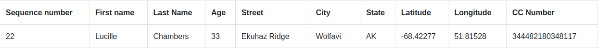

# Brutus A/S 

This repository implements a simple data visualizer for the HR department at Brutus. The application is written in Python using Django as web framework and PostgreSQL as database service.

### Details
The application visualizes a large number of records that must be uploaded to the application. It paginates ten records at a time. An example record is given below.



To index a CSV file, go to ```<host>:<port>/portal/upload/``` and upload a file. The file's records will be described as a ```Record``` model and visualized in a table in ```/portal```. To query a particular record, input a sequence number in the search box. 

### Running the application
To run the application locally, run ```docker-compose up``` from the project root directory and point your browser to ```localhost:3000/portal```.

### Datasets
```d1.csv``` and ```d2.csv``` are subsets of the CSV file that was provided with the assignment text. It contains 100k records and takes a few minutes to load. To cut to the chase, the two files are provided instead. However, the application is not limited by the size of the input file.
